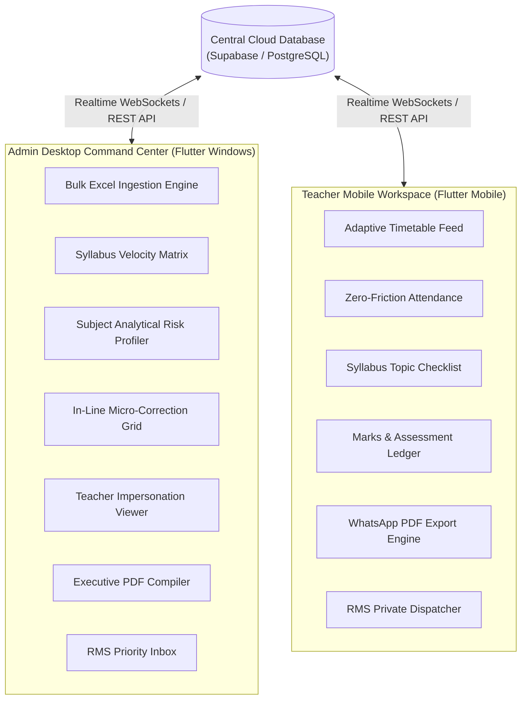
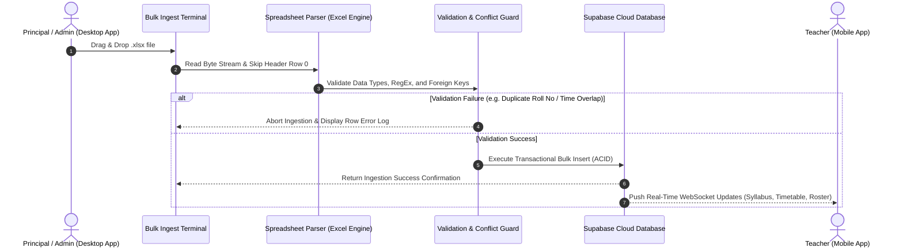

# School Management System (SMS) - Unified Feature Documentation & Excel Architecture

## 1. System Ecosystem Overview

The School Management System (SMS) operates on a centralized Supabase / PostgreSQL cloud database architecture supporting two specialized frontend clients:



---

## 2. Windows Desktop Admin Panel Features & Roadmap

### 2.1 Current Features Manual

| Module | Feature Name | Detailed Functionality & Business Logic |
| :--- | :--- | :--- |
| 📂 **01** | **Bulk Data Ingestion Engine** | • Drag-and-drop file dropzone accepting `.xlsx` spreadsheets.<br>• Built-in template generator (`Download_Student_Template.xlsx`, `Download_Timetable_Template.xlsx`).<br>• Real-time format validator with line-by-line error alerts before database commit. |
| 📉 **02** | **Syllabus Progress & Velocity Tracker** | • **Dual-Lens Filtering**: Switch between **"By Teacher"** (evaluates faculty teaching velocity across grades) and **"By Class"** (class-by-class matrix).<br>• Calculates syllabus completion ratio ($\frac{\text{Completed Topics}}{\text{Total Topics}} \times 100$).<br>• Automated delay badge highlighting subjects lagging behind target deadlines (e.g. 🚨 *Science 20% Delay*). |
| 📊 **03** | **Subject Analytical Risk Profiling Engine** | • Real-time mean score calculation ($\mu$) across quizzes, mid-terms, and final exams.<br>• Pass/Fail score distribution tiers ($A \ge 80\%$, $B \ge 60\%$, $C \ge 40\%$, Critical $<35\%$).<br>• **Automated Risk Flags**: Highlights classes with average score $<50\%$ or students dropping below $35\%$ across consecutive tests. |
| 🎛️ **04** | **Micro-Correction Data Grid** | • Excel-style editable spreadsheet UI directly inside the Flutter app.<br>• Instant cell editing for student names, roll numbers, sections, and room numbers with live cloud propagation. |
| 👤 **05** | **Teacher System Impersonation (Audit Tool)** | • Embedded interactive mobile viewport frame inside the desktop view.<br>• Allows the Principal/Admin to view the exact screen and data visible to any selected teacher in real-time. |
| 📥 **06** | **Executive PDF Compiler** | • Compiles official school administrative reports with headers, academic summary grids, attendance stats, and signature blocks. |
| 💬 **07** | **RMS Priority Inbox (Relationship Management System)** | • Direct encrypted channel receiving leave requests, equipment/maintenance reports, and confidential notes from teachers.<br>• One-click resolution triggers (*Approve*, *Reject*, *Under Review*, *Mark Resolved*). |

### 2.2 Next Plans & Expansion Roadmap for Admin Panel

1. **Role-Based Access Control (RBAC) & Multi-Admin Permissions:**
   - Super Admin (Owner), Academic Head (Vice-Principal), Accounts Manager, and Department Heads.
   - Granular permissions for record editing vs read-only audit.
2. **AI-Powered Automatic Timetable Generator:**
   - Constraint-based scheduling engine resolving teacher load, subject difficulty sequencing, room capacity, and lab availability.
3. **Financial Fee Ledger & Dues Integration:**
   - Defaulter list tracking, fee structure configuration, and receipt export.
4. **Broadcast & Emergency Notification Gateway:**
   - Multi-channel notification dispatch (SMS, WhatsApp API, Push Notifications) for school closures, exam announcements, and urgent notices.

---

## 3. Teacher Mobile App Features & Roadmap

### 3.1 Current Features Manual

| Module | Feature Name | Detailed Functionality & Business Logic |
| :--- | :--- | :--- |
| ⏰ **01** | **Adaptive Chronological Timetable Feed** | • **Default Today View**: Chronological card feed showing current active period, room number, and countdown to next class.<br>• **Expanded Week View**: Interactive 5-day grid schedule with period details. |
| ✅ **02** | **Zero-Friction Attendance Registry** | • Pre-selects all enrolled students in the class as **Present (True)** by default.<br>• Teacher taps only absent/late students, minimizing touch steps.<br>• Instant cloud sync with attendance percentage analytics. |
| 📖 **03** | **Syllabus Checklist Tracker** | • Interactive topic checklist organized by subject and chapter.<br>• Single-tap completion updates total progress bar and syncs to Admin Dashboard immediately. |
| 📝 **04** | **Marks & Assessment Entry Terminal** | • Fast score ledger for Class Tests, CA-1, CA-2, Mid-Term, and Final Exams.<br>• Displays class average and highlights at-risk students ($<35\%$) in red. |
| 📄 **05** | **Dynamic Student Progress Report & WhatsApp Direct Export** | • Compiles individual student report cards into formatted PDF documents.<br>• Integrated native OS share intent opening direct chat with parents on WhatsApp. |
| 💬 **06** | **RMS Encrypted Direct Dispatcher** | • Teacher communication hub with NLP auto-tagging (`STAFF LEAVE`, `MAINTENANCE REPAIR`, `CONFIDENTIAL`).<br>• Bypasses public school forums directly to Principal's Admin Inbox. |

### 3.2 Next Plans & Expansion Roadmap for Teacher App

1. **Offline-First SQLite Cache & Background Cloud Sync:**
   - Enables full attendance and marks recording without active internet connection, auto-syncing when network connectivity restores.
2. **Voice-to-Text Feedback Engine:**
   - Dictation integration allowing teachers to speak student remarks and exam feedback directly into report cards.
3. **Interactive Homework & Assignment Hub:**
   - Attachment uploader (PDF/Images), submission status tracker, and QR code student ID scanner.
4. **Peer Teacher Substitution Request Hub:**
   - Automated period swapping request system allowing teachers to swap timetable slots subject to admin approval.

---

## 4. Excel Sheet Architecture & Schema Specifications

The ingestion engine parses Excel `.xlsx` files, enforces strict type validation, resolves foreign keys (e.g. converting `teacher_email` to system `teacher_id`), and rejects corrupted/duplicate records before database injection.

```
📁 EXCEL TEMPLATES PACKAGE
├── 📄 Download_Student_Template.xlsx
├── 📄 Download_Timetable_Template.xlsx
├── 📄 Download_Syllabus_Template.xlsx
└── 📄 Download_Marks_Template.xlsx
```

---

### 4.1 Student Roster Ingestion Schema (`students_template.xlsx`)

#### Sheet Structure
| Col | Header Name (`snake_case`) | Data Type | Required | Example | Validation & Guard Rules |
| :---: | :--- | :--- | :---: | :--- | :--- |
| **A** | `student_id` | String | **Yes** | `STU-10A-001` | Unique primary key. Pattern: `STU-{CLASS}-{INDEX}`. |
| **B** | `roll_number` | String | **Yes** | `10A-01` | Unique within same class section. Duplicate check triggers abort. |
| **C** | `name` | String | **Yes** | `Muhammad Ali` | Min length 2 chars. Auto-trimmed. |
| **D** | `parent_phone` | String | **Yes** | `+923001234567` | E.164 international format regex: `^\+?[1-9]\d{1,14}$`. |
| **E** | `class_name` | String | **Yes** | `Grade 10` | Standardized grade label. |
| **F** | `class_id_section` | String | **Yes** | `10-A` | Relational section key (e.g., `10-A`, `9-B`). |
| **G** | `remarks` | String | No | `Active participant` | Optional text notes. Default: `"Active"`. |

---

### 4.2 Timetable Master Schedule Schema (`timetable_template.xlsx`)

#### Sheet Structure
| Col | Header Name (`snake_case`) | Data Type | Required | Example | Validation & Guard Rules |
| :---: | :--- | :--- | :---: | :--- | :--- |
| **A** | `class_id_section` | String | **Yes** | `10-A` | Must match existing active section key. |
| **B** | `subject` | String | **Yes** | `Mathematics` | Valid subject name string. |
| **C** | `teacher_email` | String | **Yes** | `s.nawaz@school.edu` | **Relational UUID Resolver**: System queries `teachers` table to map email to `teacher_id`. |
| **D** | `day_of_week` | Integer | **Yes** | `1` | Range `1` (Monday) to `5` (Friday) or `6` (Saturday). |
| **E** | `start_time` | Time String | **Yes** | `08:30:00` | 24-hour format `HH:mm:ss`. Must be before `end_time`. |
| **F** | `end_time` | Time String | **Yes** | `09:15:00` | 24-hour format `HH:mm:ss`. Must be after `start_time`. |
| **G** | `period_number` | Integer | **Yes** | `1` | Period sequence number ($1, 2, 3 \dots$). |
| **H** | `room_number` | String | **Yes** | `Room 301` | Physical room allocation. |

#### Ingestion Guard & Conflict Detection Rules
1. **Teacher Overlap Guard:** Checks if `teacher_id` is assigned to another class during overlapping `[start_time, end_time]` on the same `day_of_week`.
2. **Class Overlap Guard:** Checks if `class_id_section` is assigned to another subject during overlapping time slots.
3. **Room Conflict Guard:** Ensures `room_number` is not double-booked for two different classes simultaneously.

---

### 4.3 Syllabus Master Curriculum Schema (`syllabus_template.xlsx`)

#### Sheet Structure
| Col | Header Name (`snake_case`) | Data Type | Required | Example | Validation & Guard Rules |
| :---: | :--- | :--- | :---: | :--- | :--- |
| **A** | `syllabus_item_id` | String | **Yes** | `SYL-10A-M01` | Unique topic identifier. |
| **B** | `class_id_section` | String | **Yes** | `10-A` | Target class section. |
| **C** | `subject` | String | **Yes** | `Mathematics` | Course subject. |
| **D** | `chapter_number` | Integer | **Yes** | `1` | Chapter index integer ($> 0$). |
| **E** | `chapter_title` | String | **Yes** | `Algebraic Expressions` | Name of chapter module. |
| **F** | `topic_title` | String | **Yes** | `Polynomial Factorization` | Granular lesson topic. |
| **G** | `completion_status` | Boolean | **Yes** | `FALSE` | Boolean string (`TRUE` / `FALSE` or `1` / `0`). |

---

### 4.4 Test Records & Marks Ingestion Schema (`test_records_template.xlsx`)

#### Sheet Structure
| Col | Header Name (`snake_case`) | Data Type | Required | Example | Validation & Guard Rules |
| :---: | :--- | :--- | :---: | :--- | :--- |
| **A** | `test_id` | String | **Yes** | `TST-10A-M01` | Assessment identifier. |
| **B** | `student_id` | String | **Yes** | `STU-10A-001` | Foreign key matching `students.student_id`. |
| **C** | `student_name` | String | **Yes** | `Muhammad Ali` | Verification label matching student record. |
| **D** | `class_id_section` | String | **Yes** | `10-A` | Target class section. |
| **E** | `subject` | String | **Yes** | `Mathematics` | Subject name. |
| **F** | `title` | String | **Yes** | `Mid-Term Exam` | Name of test assessment. |
| **G** | `marks_obtained` | Double | **Yes** | `42.5` | Numeric score ($0 \le \text{marksObtained} \le \text{maxMarks}$). |
| **H** | `max_marks` | Double | **Yes** | `50.0` | Maximum total marks ($> 0$). |
| **I** | `exam_category` | Enum String | **Yes** | `midTerm` | Enum value: `classTest`, `ca1`, `ca2`, `midTerm`, `endTerm`. |
| **J** | `date` | Date String | **Yes** | `2026-08-20` | ISO format `YYYY-MM-DD`. |

---

## 5. Ingestion Engine Pipeline & Execution Workflow



---

## 6. Summary Matrix of Platform Capabilities

| Capability Category | Windows Admin Desktop | Teacher Mobile App | Cloud Sync Backend |
| :--- | :---: | :---: | :---: |
| **Bulk Data Import** | ✅ Full `.xlsx` Ingest | ❌ Read Only | ✅ Validation Engine |
| **Syllabus Tracking** | ✅ Macro Matrix & Delays | ✅ Micro Topic Toggle | ✅ Realtime Websockets |
| **Academic Analytics** | ✅ Mean ($\mu$) & Risk Spread | ✅ Instant Test Score Input | ✅ Automated Risk Profiling |
| **Timetable System** | ✅ Master Conflict Resolution | ✅ Chronological Today Widget | ✅ Conflict Guard Engine |
| **Attendance Registry** | ✅ Global Attendance Sync | ✅ One-Tap Absence Toggling | ✅ Automated Rate Analytics |
| **Communication Channel** | ✅ Priority RMS Inbox | ✅ Encrypted RMS Dispatcher | ✅ Keyword NLP Classifier |
| **Report Generation** | ✅ Executive Audit PDF | ✅ Direct WhatsApp PDF Share | ✅ Dynamic Layout Engine |

